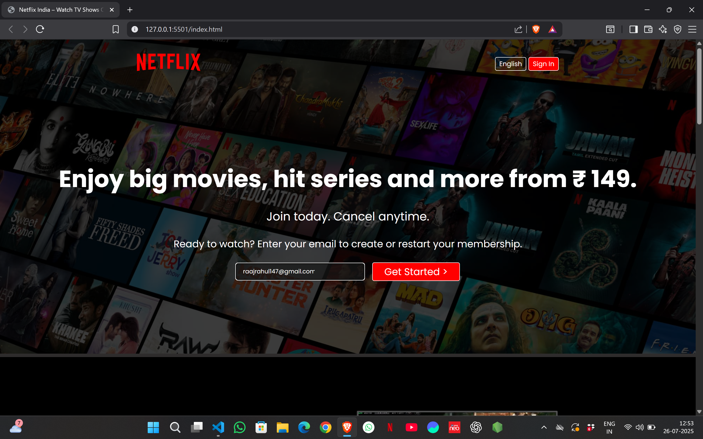

# 🎬 Netflix Clone

A responsive and visually appealing **Netflix Clone** built using **React JS**, **Firebase**, and **TMDB API**. This project simulates the core UI/UX of Netflix with user authentication, movie browsing, and persistent watchlists.

## 🔗 Live Demo With Netlify
[👉 Click here to view live](https://net-flix-clone-rahul11f.netlify.app/) 
 
 ## 🔗 Live Demo With Github 
[👉 Click here to view live](https://rahul11f.github.io/Netflix-Cone-Website/)  

> 
## 📸 Screenshots

### 🔐 Login Page

### 🏠 Home Page

### ❤️ Watchlist

### ❤️ Watch Everywhere

### 🙋🏻 Create Profile For Kids

### ❓ Frequently Asked Question

### 😎 Footer

---
## 🧑‍💻 Features

- 🔥 Responsive design for mobile, tablet, and desktop
- 🎥 Video and image overlays to simulate actual streaming banners
- 📝 Sections include:
  - Hero call-to-action
  - Feature highlights (TV, mobile, kids, offline viewing)
  - FAQ accordion section (currently static)
  - Multi-column footer with styled links

---

## 🛠️ Tech Stack

| Technology   | Description               |
|--------------|---------------------------|
| HTML5        | Page structure            |
| CSS3         | Styling & responsiveness  |
| Google Fonts | Typography (Poppins, Martel Sans) |

---

## 📁 Folder Structure

netflix-clone/
│
├── index.html # Main HTML file
├── style.css # Styling file
├── assets/ # Images and video content
└── README.md # Project documentation

---

## 📱 Responsiveness

Optimized with media queries:
- 🖥 Desktop layout
- 📱 Mobile stacked layout
- 📐 Responsive image resizing

---

## 🚀 Future Enhancements

- ✅ Add JavaScript for interactive FAQs and transitions
- 🧠 Improve accessibility (alt tags, semantic HTML)
- 🛒 Add login/signup forms
- 🖼 Lazy load images/videos

---

## 🧑‍🎓 Author

**👨‍💻 Rahul Kumar**  
B.Tech CSE Student  
📍 Lucknow, India  
📧 raajrahul147@gmail.com  
🔗 [GitHub](https://github.com/rahul11f) | [LinkedIn](https://www.linkedin.com/in/rahul-kumar147)

---

## 📜 Disclaimer

This Netflix clone is built purely for **educational purposes** and is not affiliated with or endorsed by Netflix. All trademarks and logos belong to their respective owners.

